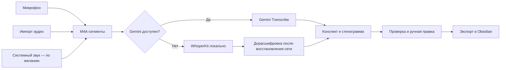

<div align="center">
  
</div>

<div align="center">
  <br>
  <strong>Нативное приложение для записи, расшифровки и разбора лекций на macOS.</strong>
  <br>
  Записывайте с микрофона или импортируйте готовое аудио, проверяйте результат и сохраняйте конспект в Obsidian.
  <br><br>
  
  
  
  
</div>

## О проекте

Whisp помогает превратить длинную лекцию в материал, с которым удобно работать. Приложение хранит записи локально, расшифровывает речь через Gemini с резервным локальным распознаванием WhisperKit и создаёт несколько вариантов текста для разных задач.

Проект находится в публичной бета-версии. Его уже можно использовать для личных записей, но перед важной лекцией стоит проверить весь сценарий на коротком аудиофайле.

## Возможности

- запись с выбранного микрофона;
- дополнительная запись системного звука Mac;
- импорт готовых аудиофайлов;
- живая и финальная расшифровка через Gemini;
- локальный fallback через WhisperKit при проблемах с сетью;
- продолжение обработки с сохранённых блоков после сбоя;
- поиск, предметы, теги и библиотека лекций;
- редактирование результата перед экспортом;
- Markdown-просмотр во всех текстовых представлениях;
- режим подготовки к зачёту и тренажёр;
- экспорт в Obsidian через WebDAV;
- HTTP- и SOCKS5-прокси;
- выбор хранения секретов: локальные настройки или macOS Keychain;
- menu bar и настраиваемые глобальные горячие клавиши.

После обработки доступны пять представлений:

| Режим | Для чего нужен |
| --- | --- |
| **Тетрадь** | Короткий структурированный конспект |
| **Разбор** | Подробное объяснение темы и ключевых понятий |
| **К зачёту** | Вопросы, карточки и типичные ошибки |
| **Стенограмма** | Чистый текст лекции с таймкодами |
| **Исходный текст** | Результат распознавания до финальной обработки |

Markdown-просмотр поддерживает заголовки, списки, цитаты, Obsidian-callout, вики-ссылки, вложения и распространённые LaTeX-формулы.

## Как работает расшифровка



Whisp фиксирует границы fallback-интервалов и позволяет позднее заменить локальный вариант облачной расшифровкой. Исходные M4A-файлы сохраняются вместе с сессией.

## Быстрый старт

### Требования

- Mac с Apple Silicon;
- macOS 15 или новее;
- полный Xcode 16 или новее;
- [Homebrew](https://brew.sh/).

### Сборка и установка

```bash
git clone https://github.com/Sppqq/whisp.git
cd whisp
bash scripts/reinstall.sh
```

Скрипт устанавливает XcodeGen при необходимости, генерирует Xcode-проект, запускает тесты, собирает Release, проверяет подпись и устанавливает приложение в `/Applications`. При ошибке предыдущая установленная версия сохраняется или восстанавливается.

Не запускайте установщик через `sudo`. Перед переустановкой завершите активную запись.

Если используется beta-версия macOS, можно явно выбрать совместимый Xcode:

```bash
DEVELOPER_DIR="/Applications/Xcode-beta.app/Contents/Developer" bash scripts/reinstall.sh
```

Лог установки сохраняется в каталоге `build`.

### Первый запуск

1. Разрешите Whisp доступ к микрофону.
2. Добавьте один или несколько Gemini API key в настройках.
3. При необходимости настройте прокси и WebDAV.
4. Проверьте подключения встроенными кнопками.
5. Импортируйте короткое аудио и проверьте результат.

Разрешение **«Запись экрана и системного звука»** требуется только при включённой записи звука приложений. Для импорта файлов и записи одного микрофона оно не нужно.

## Данные и секреты

Записи, расшифровки и конспекты находятся в локальном контейнере Whisp. Отправка в Obsidian выполняется только по команде пользователя через настроенный WebDAV.

В разделе **«Хранилище»** можно выбрать способ хранения ключей и паролей:

- **Локальные настройки** — удобны для ad-hoc сборок, но значения не шифруются отдельно;
- **macOS Keychain** — защищает значения средствами macOS, но после пересборки система может повторно запросить доступ.

При переключении Whisp сначала записывает и проверяет секреты в новом хранилище, затем удаляет старую копию.

В репозитории нет API-ключей, адресов частных серверов, логинов, паролей, пользовательских записей или локальных настроек. Для личного использования рекомендуется создать отдельный Gemini API key с собственными лимитами.

## Известные ограничения

- поддерживаются только Mac с Apple Silicon;
- интерфейс приложения пока доступен на русском языке;
- готовая подписанная и notarized-сборка пока не публикуется;
- для облачной расшифровки пользователь предоставляет собственный Gemini API key;
- качество конспекта зависит от качества записи и выбранной модели;
- WebDAV проверен прежде всего со структурой хранилища Obsidian.

## Разработка

Проект написан на SwiftUI. Xcode-проект генерируется из `project.yml` через XcodeGen.

```bash
brew install xcodegen
xcodegen generate
open Whisp.xcodeproj
```

Создание DMG:

```bash
bash scripts/build_dmg.sh
```

Проверки установщика:

```bash
python3 scripts/test_select_xcode.py
python3 scripts/test_reinstall.py
```

Для локального интеграционного теста можно положить `ex.m4a` в корень проекта. Файл игнорируется Git, а `AudioImportTests` использует его без обращения к Gemini.

## Структура проекта

```text
Whisp/
├── App/           Точка входа и сцены SwiftUI
├── Models/        Сессии, сегменты, настройки и состояния
├── Services/      Аудио, Gemini, WhisperKit, WebDAV и экспорт
├── Utilities/     Форматирование и часы записи
├── ViewModels/    Состояние приложения и сценарии
└── Views/         Запись, библиотека, проверка и настройки

WhispTests/        Модульные и регрессионные тесты
scripts/           Сборка, тестирование и безопасная установка
project.yml        Конфигурация XcodeGen
```

## Обратная связь

Если Whisp падает, теряет фрагмент записи или некорректно восстанавливает сессию, создайте [issue](https://github.com/Sppqq/whisp/issues). Приложите версию macOS, модель Mac, шаги воспроизведения и обезличенный фрагмент лога. Не публикуйте API-ключи, пароли и содержимое личных лекций.

<div align="center">
  <sub>Сделано для тех, кто хочет слушать лекцию, а не переписывать её.</sub>
</div>
