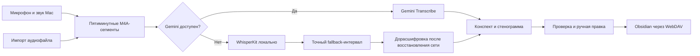

<div align="center">
  
</div>

<div align="center">
  <br>
  <strong>Нативное приложение для записи, расшифровки и разбора лекций на macOS.</strong>
  <br>
  Gemini обрабатывает речь, локальный Whisper страхует соединение, а результат сохраняется в Obsidian.
  <br><br>
  
  
  
  
</div>

## Что умеет Whisp

Whisp записывает микрофон и звук приложений отдельными M4A-дорожками или принимает готовый аудиофайл. Во время лекции приложение показывает живую расшифровку, а после завершения создаёт несколько представлений материала:

- **Тетрадь** — компактный конспект для повторения;
- **Разбор** — подробная структура лекции с ключевыми понятиями;
- **К зачёту** — вопросы, карточки и типичные ошибки;
- **Стенограмма** — отредактированный текст с таймкодами;
- **Исходный текст** — результат распознавания до финальной обработки.

Встроенный Markdown-просмотр понимает заголовки, списки, цитаты, Obsidian-callout, вики-ссылки, вложения и распространённые LaTeX-формулы. Перед экспортом любой текст можно отредактировать вручную.

## Надёжная расшифровка



- Gemini используется для живой и финальной расшифровки.
- WhisperKit Large v3 Turbo работает как локальная страховка.
- Начало и причина каждого fallback-интервала сохраняются точно.
- После восстановления Gemini можно сравнить локальный и облачный варианты.
- Обработка продолжается с сохранённых блоков и не начинается заново после сбоя.

## Интерфейс

Whisp использует SwiftUI и следует системному оформлению macOS. В приложении есть поиск по лекциям, фильтры по предметам, управление воспроизведением, редактируемые конспекты, режим тренажёра, menu bar и настраиваемые глобальные горячие клавиши.

Интерфейс полностью русскоязычный. Светлая и тёмная темы наследуются от системы.

## Установка

### Требования

- Mac с Apple Silicon;
- macOS 15 или новее;
- Xcode 16 или новее;
- Homebrew.

На macOS beta используйте совместимую beta-версию Xcode.

### Сборка и переустановка

```bash
git clone https://github.com/Sppqq/whisp.git
cd whisp
bash scripts/reinstall.sh
```

Скрипт находит полноценный Xcode, генерирует проект через XcodeGen, запускает XCTest, собирает Release, проверяет подпись и безопасно заменяет `/Applications/Whisp.app`. Если сборка или установка прервётся, предыдущая версия приложения останется на месте либо будет восстановлена.

Не запускайте установщик через `sudo`. Активную запись перед переустановкой необходимо завершить.

Конкретный Xcode можно выбрать без изменения системных настроек:

```bash
DEVELOPER_DIR="/Applications/Xcode-beta.app/Contents/Developer" bash scripts/reinstall.sh
```

Лог сохраняется в `build/reinstall-YYYYMMDD-HHMMSS.log`.

### Первый запуск

1. Разрешите доступ к микрофону.
2. Для записи звука приложений разрешите **Запись экрана и системного звука**.
3. Полностью перезапустите Whisp после выдачи разрешений.
4. Добавьте Gemini API key в настройках.
5. При необходимости настройте HTTP/SOCKS5-прокси и WebDAV.
6. Проверьте подключения соответствующими кнопками.

## Хранение данных

Записи, расшифровки и конспекты находятся в локальном контейнере приложения. Синхронизация с Obsidian выполняется только после команды пользователя через настроенный WebDAV.

В репозитории **нет** API-ключей, адресов частных серверов, логинов и паролей. Локальные сборки, Xcode-проекты, аудиозаписи и пользовательские настройки исключены через `.gitignore`.

> [!WARNING]
> В разделе «Хранилище» можно выбрать локальные настройки или macOS Keychain. Локальные настройки не вызывают системных запросов после ad-hoc пересборки, но не шифруют значения на диске. При переключении Whisp сначала проверяет копию секретов в новом хранилище и только затем удаляет старую.

## Разработка

Проект описан в `project.yml` и генерируется через XcodeGen:

```bash
brew install xcodegen
xcodegen generate
open Whisp.xcodeproj
```

Для создания DMG:

```bash
bash scripts/build_dmg.sh
```

Проверки установщика:

```bash
python3 scripts/test_select_xcode.py
python3 scripts/test_reinstall.py
```

Тестовый `ex.m4a` можно положить в корень проекта локально. Файл игнорируется Git, а `AudioImportTests` использует его для проверки записи без обращения к Gemini.

## Структура проекта

```text
Whisp/
├── App/           Точка входа и сцены SwiftUI
├── Models/        Сессии, сегменты, настройки и состояния
├── Services/      Аудио, Gemini, WhisperKit, WebDAV и экспорт
├── Utilities/     Форматирование и часы записи
├── ViewModels/    Состояние приложения и пользовательские сценарии
└── Views/         Запись, библиотека, проверка и настройки

WhispTests/        Регрессионные и модульные тесты
scripts/           Сборка, тестирование и безопасная установка
project.yml        Конфигурация XcodeGen
```

## Статус

Whisp — личный экспериментальный проект. Он не предназначен для App Store или публичного сервиса. Перед важной лекцией проверьте короткую запись, fallback без сети, итоговые M4A-файлы и тестовую загрузку в отдельную папку WebDAV.

<div align="center">
  <sub>Сделано для тех, кто хочет слушать лекцию, а не переписывать её.</sub>
</div>
